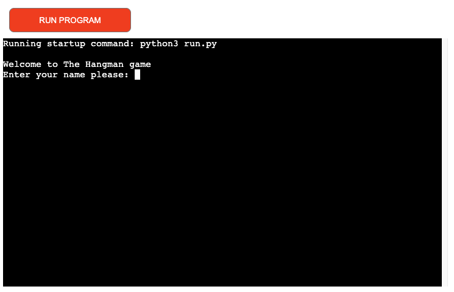
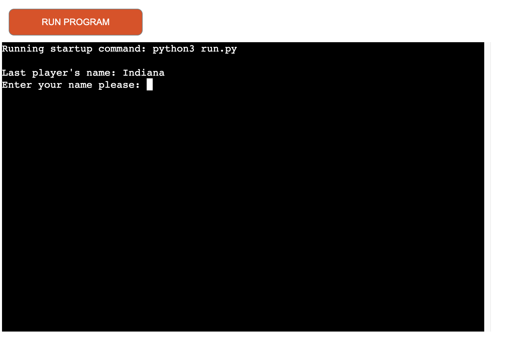
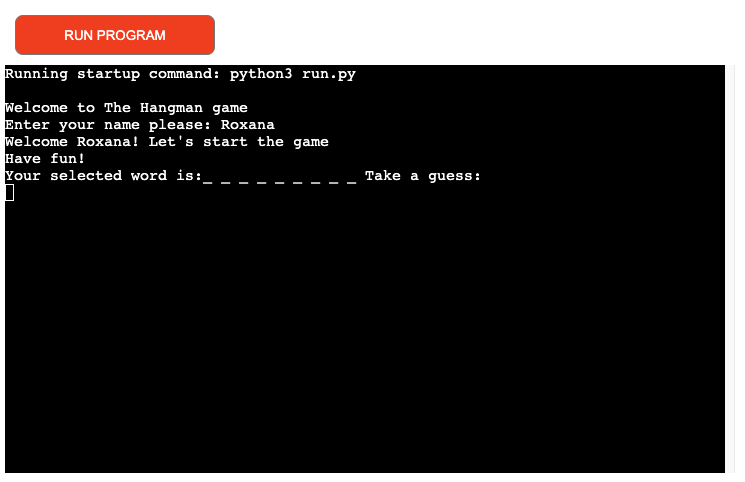
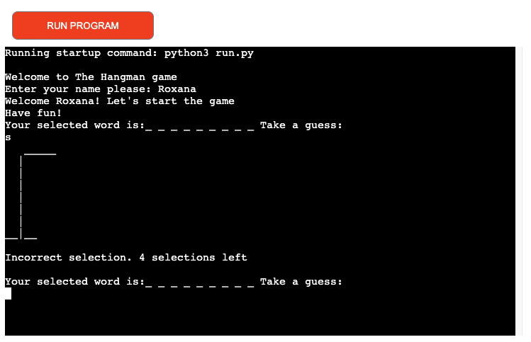
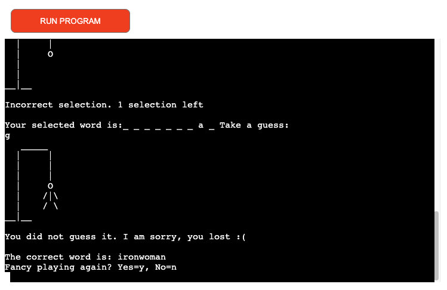
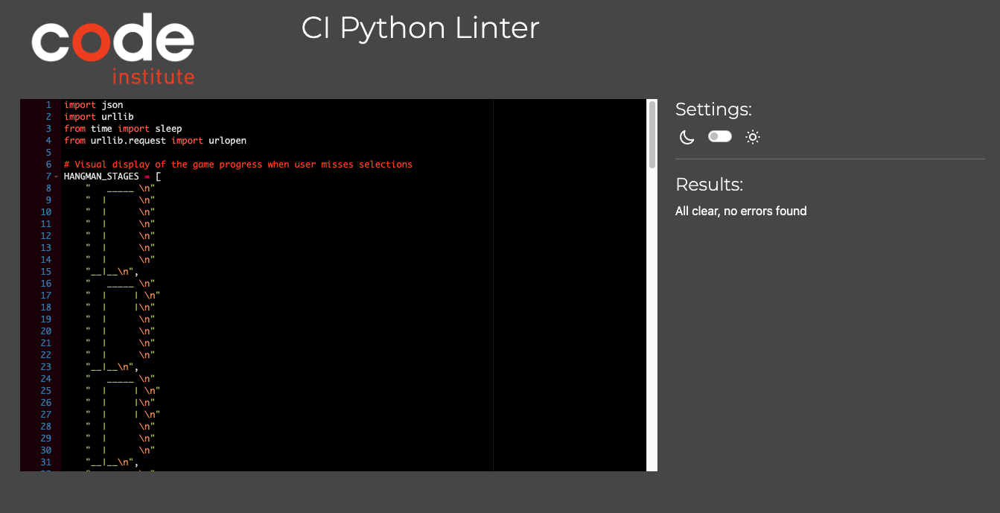

# The Hangman game application
Online version of this quick and simnple word guessing game.

Please click here [link](https://thehangman-422749aac0f2.herokuapp.com/) to access the game.

## Project background 

The Hangman game was created as part of Milestone project 3. The functionality of the game was developed using Python. The application targets broad population of online users who would like to play a simple game of words guessing, known as The Hangman.

## Application design

-**Overall application concept** - the main concept of the game is for an online user to try to guess randomly selected word. The application logic was developed using Python and includes components such as functions, loop and creation of 
random words with the help of external application connected to this application. The user visualisation of the game progress is based on the basic characters to outline the progress.

-**Player rules** : 
1. Each player has a limit of 5 potential failed attempts to select a correct letter contained in the randomly selected word.
2. If the selected letter is contained in the word, it will be reflected on the screen accordingly.
3. If the selected letter is not contained in the word, the player's 5 attempts continue to reduce and a hangman starts to be displayed on the screen.
4. The outcome of the game is either the player guesses the entire word or the player runs out of the attempts and the game ends with hangman being fully displayed on the screen.

## Application features

The game and its key features have been outlined below.

1. **Game Screen**- each online player is welcomed by game's initial screen and message.
   On the screen there is also the name of the previous person who played the game. Googlesheets API has been setup to support this functionality.

2. **Player Name Input and Welcome Message**- before the game commences the player will be asked to input the name and related message is displayed.

3. **Game Progress**- as the player continues to guess the word the progress of the game is outlined on the screen accordingly.

4. **Game Outcome**- each game is either won or lost by the player with relevant message displayed by the application.

## Testing 

As part of project development there were 2 areas of testing completed:

**Functional testing**

The below testing was completed in terms of application functionality: 

1. **Player name input** - it has been tested successfuly to confirm that player's name can be submitted and it will be displayed in the game message accordingly. 
2. **Player input** - it has been tested that the user input on the screen will be validated against letters included in the randomly selected word. Player's blank and non alphabetical inputs are validated, with relevant message displayed.
   Any instances of player's duplicate letter input (i.e letter already selected) will be also handled with relavant message displayed.
3. **Game progress**- it has been tested and validated that the game progress will update on the screen appropriately. If the user selects a correct letter it will be reflected on the game screen accordingly. In the event of player not selecting   a letter included in the word, the drawing of the hangman will progress.
4. **Game outcome** - each game will be concluded either by the player winning or losing. A message is dispalyed for the player to opt between a retry or to terminate the game. It was observed during testing that at the time when the player    
   guesses the correct word, the word itself does not get displayed in its entirety for the player to see. This was noted as an unfixed bug.
5. **Previous player name** - it was also tested that the previous player's name is also stored correctly in googlesheets and displayed to the next player.

**Code validation testing**

Validation of the code was completed in Code Institute's Python Linter (URL https://pep8ci.herokuapp.com/)
The code has successfully passed the valiation.

## Future application enhancements

Some of the potential future enhancements are as follows:

1. The application uses an external source to create random words. Perhaps some level of back-up will need to be arranged in case if the external random word selector is unavailable for whatever reason.
2. The game display is quite basic and relies on simple keyboard characters. Introduction of some graphical elements could attract more players.
3. At the present the players are provided with random words with no indicative of a specific thyme of the word. This makes the game at time difficult, therefore introduction of a thyme could help the players to be more successful in winning.
4. As the game progresses and the player may know the word, the game application should allow for the player to input the complete word instead adding individual letters.
5. Allow the players to select difficulty level of the game so that the word selection is adequate to the level played.
6. Add scoreboard with best players' names.

## Bugs ## 

**Fixed Bugs**

- At some stage during the development it was identified that the duplicate letter by the player did not have any message displayed unless the letter was contained within the word. This was subsequently resolved and now each duplicate
  letter selection is highlighted through a game message accordingly.
- The validation of the player input was initially limited to blank input, duplicate (already selected) letter input. Now the non alphabetical or 2 characters are also validated, with relevant user message displayed.
  
**Unfixed Bugs**

- At the end of the game player selection, which is not either Y or N, does not display any validation related message.
- When the player guesses the word correctly, the actual complete word is not displayed for the player on the screen. The code will need to be enhanced to display the guessed word entirely.

## Deployment process 

The application needed to be deployed to Heroku and the following steps were required to do so:

1. Sign up to Heroku was required.
2. New application needed to be created in Heroku. This required application name to be selected along required region (Europe).
3. Configuration settings were needed to be setup in Heroku such as PORT = 8000.
4. Buildpacks for Python and Nodejs also required to be selected.
5. In the Deploy tab of Heroku GitHub depository needed to be selected in order to connect it with Heroku for deployment.
6. Deploy Branch button in Heroku was used to submit a build of the application in Heroku.
7. When the application was deployed successfully, the URL for the application has become available in the Settings tab in Heroku.

## Credits

1. The application uses external application to obtain randon words for each game. The source of random words is based in the following URL: https://random-word-api.herokuapp.com/word?number=1
2. The project was influenced by some elements of the walk through project Love Sandwiches and a number of external projects, which had been researched and reviewed.

